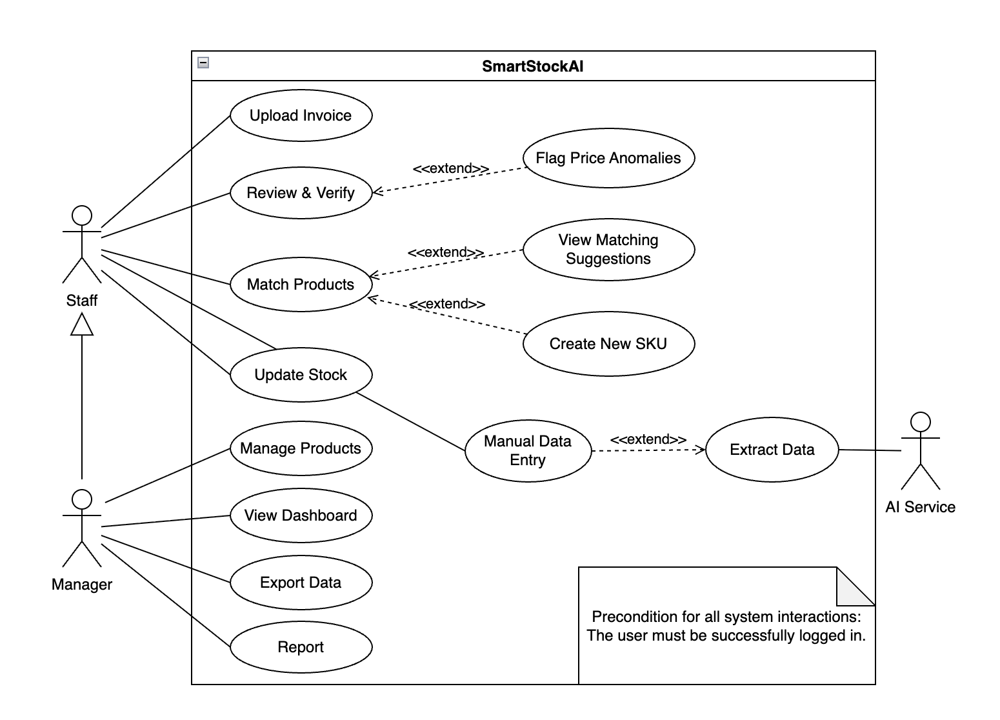

# SmartStockAI: Intelligent Invoice Matching & Inventory Pipeline

## 🎯 Overview
**SmartStock AI** is an end-to-end automated pipeline engineered to eliminate the "data entry bottleneck" in retail and logistics management.

In traditional warehousing, manual invoice entry is a time-consuming process prone to human error. This project bridges that gap by transforming messy, unstructured paper invoices into actionable inventory insights. By integrating **AI-powered OCR** with a custom **Intelligent Matching Engine**, the system automates the transition from raw text to standardized master data.

## 📌 Key Features
Overall Use Case Diagram

## 📌 Documents
Business Analysis & System Design:
https://drive.google.com/drive/folders/1RLgUuz7pkLARTbhY5YOB13V05gxVKyjW?usp=sharing
https://app.diagrams.net/#G1DlirVI4X2pJqStyycVYUX9p9qF9jklHJ#%7B%22pageId%22%3A%22q8O2vjugN0eP9JsEey4i%22%7D

## 🚀 Live Demo

## 🛠 Tech Stack

| Component | Technology |
| :--- | :--- |
| 🖥️ **Frontend** | **Next.js, TanStack Query, Tailwind CSS, Shadcn/ui, Framer Motion** |
| 🐍 **Backend** | **Python, FastAPI, Pydantic, SQLModel (ORM)** |
| 📊 **Database** | **PostgreSQL** |
| ☁️ **Cloud Storage** | **AWS S3/ Supabase** |
| 🤖 **AI Orchestration** | **LangChain, Google Cloud Document AI, Gemini 1.5** |
| 🧠 **Algorithm** | **RapidFuzz, Keyword Scoring Logic** |
| 🔐 **Security** | **NextAuth.js, JWT (JSON Web Token)** |
| 🐳 **Infrastructure** | **Docker, Docker Compose, GitHub Actions (CI/CD)**|

## Quick Start