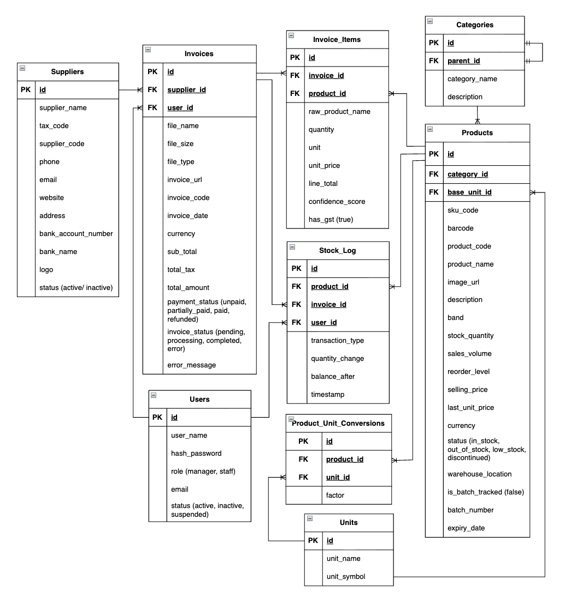

# CHAPTER 2: System requirements

## 2.1 Use Case Diagram

**Actors:** 
- Warehouse Staff
- Manager
- AI Service

**Usecases:**
- **Invoice Processing**
    - UC-01: Upload Invoice
    - UC-02: Extract Data
    - UC-03: Review & Verify
    - UC-04: Match Products
- **Matching Product Extensions**
    - UC-2.1: Manual Data Entry
    - UC-3.1: Flag Price Anomalies
    - UC-4.1: View Matching Suggestions
    - UC-4.2: Create New SKU
- **Inventory & Management**
    - UC-05: Update Stock
    - UC-06: Manage Products
    - UC-07: View Dashboard
    - UC-08: Export Data 
    - UC-09: Report

The General Use Case Diagram provides a high-level overview of the SmartStock AI System's functionalities and the interactions between its primary and secondary actors. This diagram captures the core business logic of the automated invoice processing and inventory management workflow.

**Key Components of the Diagram:**
- **Primary Actors:** 
    - **Warehouse Staff:** Responsible for the operational workflow, including uploading invoices, verifying data, and reconciling product mappings.
    - **Manager/Admin:** Inherits all staff permissions with additional oversight, such as managing the product catalog, accessing analytics dashboards, and generating reports.
- **Secondary Actor (AI Service):** An external service (e.g., Google Document AI or Gemini API) that performs automated OCR and structured data extraction.
- **System Scope:** The system covers the entire lifecycle of an invoice, from initial ingestion and AI-driven extraction to intelligent product matching and final stock updates.
- **Extended Capabilities:** To handle real-world complexities, the system includes flexible logic such as Fuzzy Matching Suggestions, Manual Data Entry overrides, and Quick SKU Creation for new products.

*Note: All use cases require Login as a pre-condition; it is omitted here to keep the diagram clear and focused.*

---

## 2.2 Functional Requirements & User Stories Mapping

### UC-01: Upload Invoice
- **User Story:** As a staff, I want to upload invoice files so that the system can begin the digitization process.
- **Acceptance Criteria (AC):**
    - AC.01: System accepts PDF, PNG, and JPG formats.
    - AC.02: File size is validated (Max 5MB).
    - AC.03: Users see a real-time upload progress bar.
- **Functional Requirements (FR):**
    - FR.01: The system shall provide a drag-and-drop upload interface.
    - FR.02: The system shall store uploaded files in a secure cloud storage (e.g., AWS S3, Google Cloud Storage, Supabase).

### UC-02: Extract Data
- **User Story:** As a user, I want the system to automatically read text from the invoice to avoid manual typing.
- **Acceptance Criteria (AC):**
    - AC.01: Extract fields: supplier, tax number, total amount, product name, quantity, price, UOM - Unit of Measure,...
    - AC.02: Accuracy > 95% for standard digital invoices.
    - AC.03: Processing time < 5 seconds per page.
- **Functional Requirements (FR):**
    - FR.01: The system shall integrate with an AI/OCR engine.
    - FR.02: The system shall parse unstructured OCR text into a structured JSON format.

### UC-03: Review & Verify
- **User Story:** As a staff, I want to review extracted data side-by-side with the original image to ensure 100% accuracy.
- **Acceptance Criteria (AC):**
    - AC.01: Display a split-view UI (Image vs. Data fields).
    - AC.02: Highlight fields with low confidence scores in red.
- **Functional Requirements (FR):**
    - FR.01: The system shall render a synchronized scroll between the image and data table.
    - FR.02: The system shall flag data discrepancies for user attention.

### UC-04: Match Products
- **User Story:** As a user, I want the system to link invoice items to existing warehouse SKUs automatically.
- **Acceptance Criteria (AC):**
    - AC.01: Auto-link if string similarity is > 95%.
    - AC.02: Display "Matched" status upon successful link.
- **Functional Requirements (FR):**
    - FR.01: The system shall perform a lookup against the Master Product Database.
    - FR.02: Confidence Scoring: Displays the confidence level of the match (e.g., 90% Match -> Automatic Selection; 60% Match -> Warning: User should recheck).

### UC-05: Update Stock
- **User Story:** As a staff, I want to confirm the final data to update inventory levels in real-time.
- **Acceptance Criteria (AC):**
    - AC.01: Stock quantity updates instantly in the Database
    - AC.02: A historical transaction log is created.
- **Functional Requirements (FR):**
    - FR.01: The system shall perform a Database transaction to ensure data integrity.

### UC-06: Manage Products
- **User Story:** As a Manager, I want to manage the product list to keep the database clean.
- **Acceptance Criteria (AC):**
    - AC.01: Perform CRUD (Create, Read, Update, Delete) on SKUs.
- **Functional Requirements (FR):**
    - FR.01: The system shall provide a searchable and filterable Product Management table.

### UC-07: View Dashboard
- **User Story:** As a Manager, I want to view a visual dashboard to monitor stock trends and spending.
- **Acceptance Criteria (AC):**
    - AC.01: Charts update in real-time.
    - AC.02: Support date filtering (Last 7 days, 30 days, etc.).
- **Functional Requirements (FR):**
    - FR.01: The system shall aggregate data to render Spend and Volume analytics.

### UC-08: Export Data
- **User Story:** As a manager, I want to export reports to Excel for accounting and auditing.
- **Acceptance Criteria (AC):**
    - AC.01: Download as .xlsx or .csv,...
- **Functional Requirements (FR):**
    - FR.01: The system shall utilize an export library to generate downloadable data sheets.

### UC-09: Report
- **User Story:** As a manager, I want to see a report such as total spending per category so that I can optimize our procurement budget.
- **Acceptance Criteria (AC):**
    - AC.01: Shows reports such as total spend per supplier; Visualized with charts; Downloadable as a professional PDF.
- **Functional Requirements (FR):**
    - FR.01: The system shall aggregate line-item totals and calculate category-wise distribution.

### UC-2.1: Manual Data Entry
- **User Story:** As a user, I want to manually enter or edit fields if the AI fails to extract them correctly.
- **Acceptance Criteria (AC):**
    - AC.01: All extracted fields are editable.
    - AC.02: Data is saved only after the user clicks "Save".
- **Functional Requirements (FR):**
    - FR.01: The system shall provide a form-validation layer for manual inputs.

### UC-3.1: Flag Price Anomalies
- **User Story:** As a Manager, I want to be alerted of price anomalies to control procurement costs.
- **Acceptance Criteria (AC):**
    - AC.01: Alert triggers if Unit Price is > 15% higher than the historical average or > threshold that user defined.
- **Functional Requirements (FR):**
    - FR.01: The system shall query historical purchase data to calculate price variance.

### UC-4.1: View Matching Suggestions
- **User Story:** As a user, I want to see a list of similar products when an exact SKU match is not found.
- **Acceptance Criteria (AC):**
    - AC.01: Show Top 3 closest matches with Confidence Scores.
    - AC.02: Users can select a suggestion to confirm.
- **Functional Requirements (FR):**
    - FR.01: The system shall utilize Fuzzy Logic for suggestions.	
    - FR.02: The system shall utilize product’s name for Fuzzy Logic

### UC-4.2: Create New SKU
- **User Story:** As a user, I want to register a new product directly from the matching screen, since the items on the invoice are new.
- **Acceptance Criteria (AC):**
    - AC.01: "Quick Add" form includes: Product Name, Category, and Unit,...
    - AC.02: Prevent duplicate SKU names.
- **Functional Requirements (FR):**
    - FR.01: The system shall execute an 'Insert' command to the Product table.

---

## 2.3 Non-Functional Requirements

### Performance
- **Response Time:** The system shall respond to user interactions (navigation, filtering, searching) within less than 2 seconds to ensure a smooth user experience.
- **Processing Speed:** The AI data extraction process for a standard single-page invoice must be completed within 10 seconds from the time of upload.
- **Matching Speed:** The system must execute product matching logic across a database of up to 10,000 SKUs in under 1 second.

### Accuracy & Reliability
- **OCR Accuracy:** The automated data extraction must achieve a minimum accuracy rate of 95% for digital PDFs and 85% for high-quality scanned images.
- **Data Integrity-Atomic Transaction:** All inventory updates must ensure that stock levels are never partially updated in the event of a system failure.
- **System Availability:** The platform shall maintain an uptime of 99.9% (24/7) to ensure warehouse operations are not interrupted during peak hours.

### Security
- **Authentication:** The system must implement a secure multi-factor authentication (MFA)
- **Authorization:** Access control shall be managed via Role-Based Access Control (RBAC)
- **Data Protection:** All sensitive data, including supplier information and invoices, must be encrypted at rest and in transit using industry-standard protocols

### Usability
- **User Interface:** The UI shall be designed with a user-centric approach, ensuring that a new user can complete the core invoice-to-stock workflow
- **Error Handling:** The system must provide clear, non-technical error messages and guidance for resolution when an invalid file format or a processing error occurs.

---

## 2.4 System Requirements

### Client-Side Requirements (For Users)
- **Web Browser:** The application shall be compatible with the latest versions of Google Chrome, Mozilla Firefox, and Microsoft Edge.
- **Operating System:** Cross-platform compatibility for Windows 10/11, macOS, and Linux.
- **Internet Connectivity:** A stable connection with a minimum speed of 5 Mbps for smooth high-resolution invoice uploads.

### Server-Side Requirements
- **Cloud Infrastructure:** The system shall be hosted on AWS (Amazon Web Services) or Google Cloud Platform (GCP) for high availability.
- **Database:** Relational Database PostgreSQL or MySQL for structured Master Data (SKUs, Suppliers, Transactions).
- **Object Storage:** Amazon S3 or Google Cloud Storage for storing original invoice images/PDFs.
- **Runtime Environment:** Node.js or Python (FastAPI/Django) environment to handle business logic and AI integration.

### AI & Integration Requirements
- **OCR & Extraction Service:** Integration with Gemini 1.5 Flash API or Google Document AI for high-accuracy data extraction.
### Development & Maintenance Requirements
- **Version Control:** All source code shall be managed and versioned using Git (GitHub/GitLab).
- **Containerization:** The application shall be containerized using Docker to ensure consistency across development, staging, and production environments.
- **Deployment:** Use Render/Vercel, AWS/ Supabase to deploy the application.

---

## 2.5 Activity Diagram

## 2.6 Sequence Diagram

## 2.7 Entity-Relationship Diagram (ERD)

### Entities:
- **Users:** Stores identity and access management (IAM) data for system personnel (e.g., Warehouse Staff, Managers).
- **Suppliers:** A master directory of all vendors and business partners. It stores critical identification data such as Legal Name, Tax ID (VAT), and Address, which are used by the AI to validate the origin of extracted invoices.
- **Invoices:** Represents the Header information of a processed document. It captures high-level data including Invoice Number, Issue Date, Currency, and Total Amounts. 
- **Invoice_Items:** A transactional table storing individual Line-items extracted from the invoice body. It records the product information.
- **Products:** The central SKU Master Data repository. It defines official product names, internal SKU codes, and the Base Unit of measure. It tracks the real-time current_stock levels and serves as the source of truth for all inventory balances.
- **Categories:** Defines the hierarchical classification of products (e.g., Beverages, Electronics, Dry Foods). It enables structured reporting, inventory organization, and helps narrow down search parameters during the product matching process.
- **Units:** A standardized registry of all Units of Measure (UoM) supported by the system (e.g., Piece, Can, Box, Kilogram). This ensures data naming consistency across the platform, preventing duplicate or erroneous entries.
- **Product_Unit_Conversions:** Manages the mathematical relationship between different packaging units and the stored Base Unit. It allows the system to automatically calculate stock increments when a product is purchased in bulk (e.g., 1 box = 24 packages).
- **Stock_Logs:** An immutable Audit Log that records every transaction affecting stock levels. It provides full traceability for inventory movements, capturing the timestamp, transaction type, quantity change, and the associated user/invoice.

### Relationship:
- Suppliers - Invoices (1:N)
- Invoices - Invoice_Items (1:N)
- Products - Invoice_Items (1:N)
- Categories - Products (1:N)
- Units - Products (1:N)
- Products - Product_Unit_Conversions (1:N)
- Units - Product_Unit_Conversions (1:N)
- Products - Stock_Logs (1:N)

